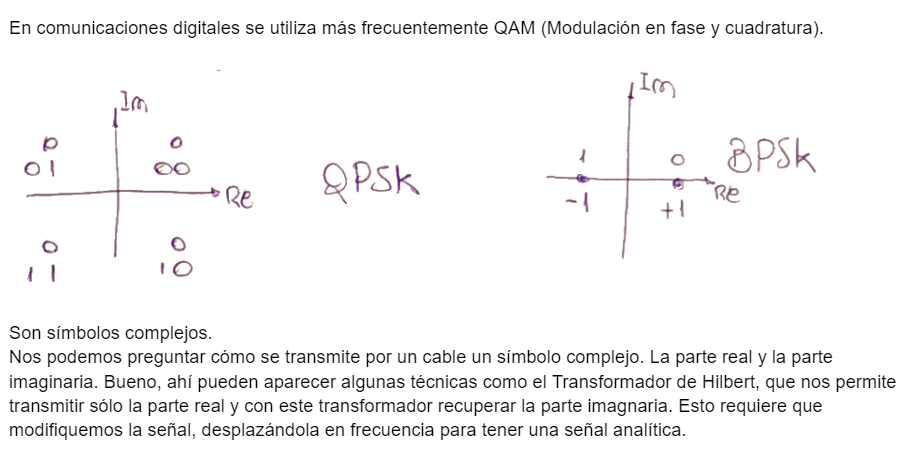
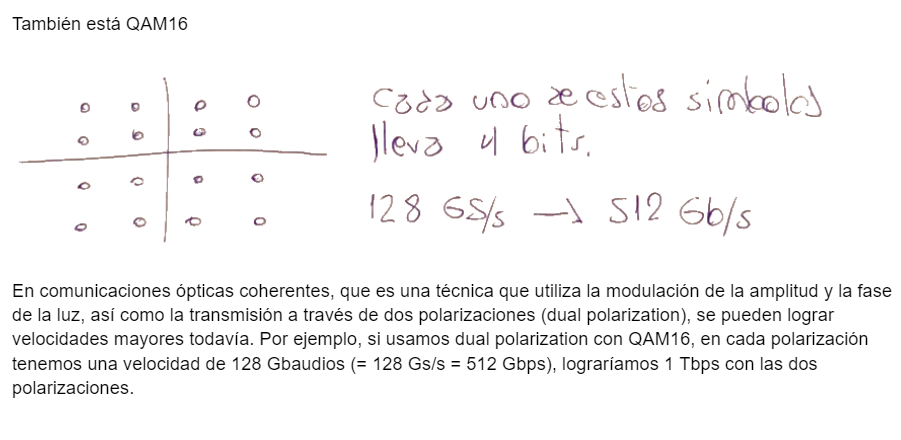

.. -*- coding: utf-8 -*-

.. _rcs_subversion:

Clase 12 - PIII 2022
====================
(Fecha: 23 de septiembre)

.. figure:: images/sistema_comunicaciones_parte1.png

.. figure:: images/sistema_comunicaciones_parte2.png

.. figure:: images/sistema_comunicaciones_parte3.png

.. figure:: images/sistema_comunicaciones_parte4.png

`Filtro transmisor (ipynb) <https://colab.research.google.com/drive/1TTM3s-seiJ2C7BfwcByFCVduOuGDdTeF?usp=sharing>`_ 
================================

- Probar el siguiente ejemplo:

.. code-block:: python

	import numpy as np
	import matplotlib.pyplot as plt
	plt.style.use( 'seaborn-darkgrid' )

	# ====================
	#  Generación de g[n] 
	# ====================

	fB = 32e9    # Velocidad de simbolos (baud rate)
	# Es la frecuencia de los simbolos, 32 GBaudios

	T = 1 / fB   # Tiempo entre símbolos
	M = 8        # Factor de sobremuestreo
	fs = fB * M  # Sample rate

	alpha = 0.1  # Factor de roll-off
	L = 20       # ( 2 * L * M + 1 ) es el largo del filtro sobremuestreado

	t = np.arange( -L, L, 1 / M ) * T

	gn = np.sinc( t / T ) * np.cos( np.pi * alpha * t / T ) / ( 1 - 4 * alpha**2 * t**2 / T**2 )

	fig, axs = plt.subplots( nrows = 2, ncols = 1 )
	fig.set_figwidth( 15 )
	fig.set_figheight( 10 )

	axs[ 0 ].stem( t, gn, use_line_collection = True )
	axs[ 0 ].set_title( 'Gráfico 1' )
	axs[ 0 ].set_xlabel( 'n' )
	axs[ 0 ].set_ylabel( 'gn' )

	axs[ 1 ].stem( t[ 100 : 150 ], gn[ 100 : 150 ], use_line_collection = True )
	axs[ 1 ].set_title( 'Gráfico 2' )
	axs[ 1 ].set_xlabel( 'n' )
	axs[ 1 ].set_ylabel( 'gn' )

	plt.show()

Entregable 09
=============

- Acercar el aspecto a la siguiente gráfica. Es decir, adornar con las leyendas, ejes de coordenadas, etc.

.. figure:: images/filtro_sinc_plot.png

- Entrar al siguiente `link para ver el registro de los entregables <https://docs.google.com/spreadsheets/d/1VoiVIgvt3YoovQd4rFNI_tZY8dY8n2t-qkV3o7WgaOY/edit?usp=sharing>`_ 

