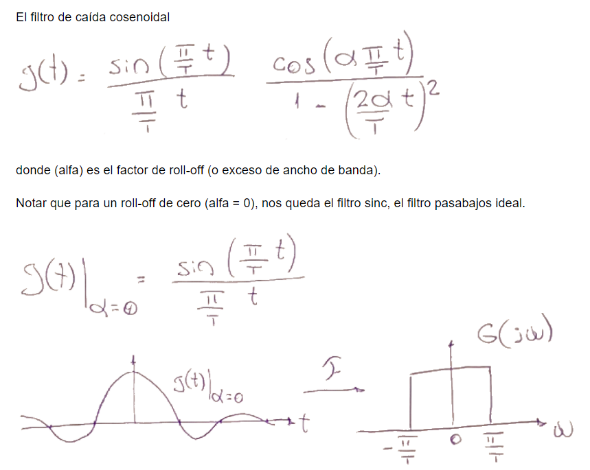
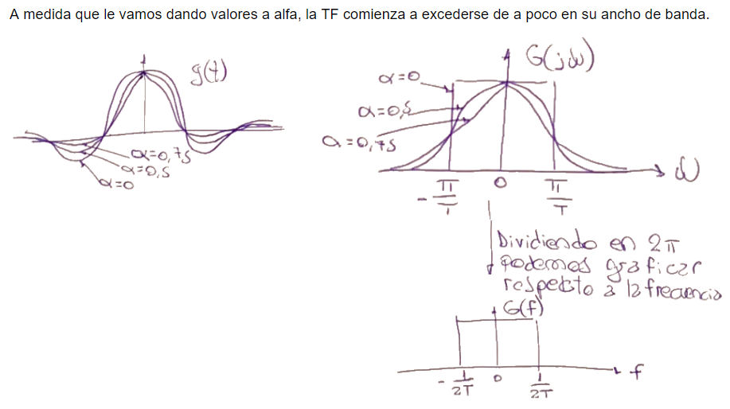
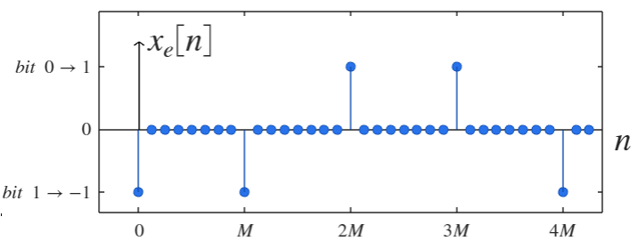
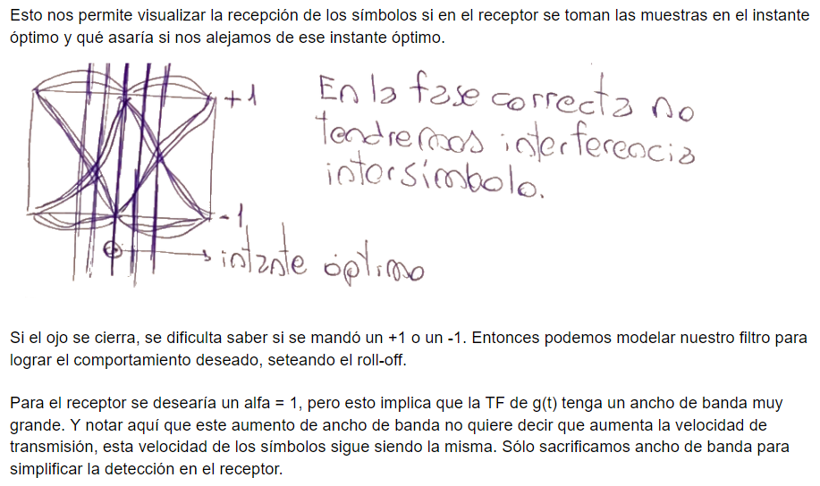
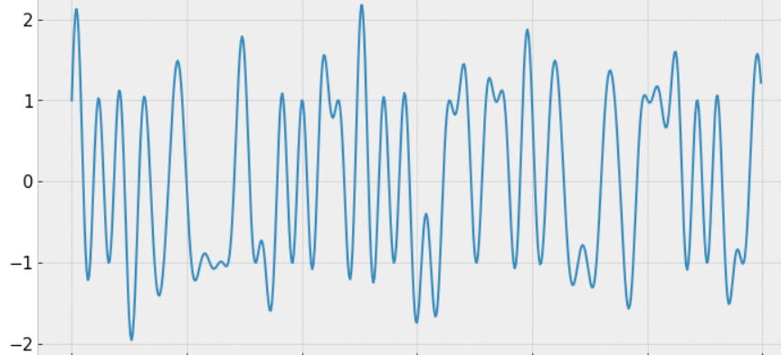
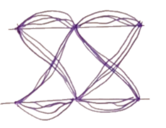

.. -*- coding: utf-8 -*-

.. _rcs_subversion:

Clase 14 - PIII 2022
====================
(Fecha: 3 de octubre)

Secuencia extendida 
===================

.. figure:: images/ojo_parte1.png

.. figure:: images/ojo_parte2.png

.. figure:: images/ojo_parte4.png

`Señal transmitida y Diagrama ojo (ipynb) <https://colab.research.google.com/drive/13AV86YDrFffWyxYTAzEgEBO6KNH6dras?usp=sharing>`_ 
================================

.. figure:: images/ojo_parte6.png

Entregable 11
=============

- **1-** Lograr la secuencia extendida mostrada anteriormente.

- **2-** Realizar el diagrama ojo para PAM4
- **3-** Ampliar la gráfica del diagrama ojo para visualizarla más cercana a la siguiente imagen:

- Entrar al siguiente `link para ver el registro de los entregables <https://docs.google.com/spreadsheets/d/1VoiVIgvt3YoovQd4rFNI_tZY8dY8n2t-qkV3o7WgaOY/edit?usp=sharing>`_ 

