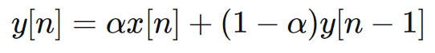

.. -*- coding: utf-8 -*-

.. _rcs_subversion:

Clase 15 - PIII 2022
====================
(Fecha: 14 de octubre)

Obtener la TF de g[n]
=====================

.. figure:: images/TF_gn_parte1.png

.. figure:: images/TF_gn_parte3.png

.. figure:: images/TF_gn_parte4.png

.. figure:: images/TF_gn_parte5.png

.. figure:: images/TF_gn_parte6.png

`Cálculo de la TF de g[n] (ipynb) <https://colab.research.google.com/drive/10sDyrNvIYlGaNo2VzqeJMYeJuP1THdYr?usp=sharing>`_ 
================================

Exponential Moving Average Filter
=================================

- La ecuación en diferencia para este filtro es la siguiente:

- alpha está en el intervalo ``[0, 1]`` y es el factor de suavizado
- ``y[n]`` es la salida actual
- ``y[n - 1]`` es la salida anterior
- ``x[n]`` es la entrada actual

Ejemplos con distintos valores de factor de suavizado
-----------------------------------------------------

.. figure:: images/ema_alpha_01.png

.. figure:: images/ema_alpha_02.png

- Se llama exponencial porque el factor de ponderación aplicado a las entradas pasadas disminuye exponencialmente. Lo podemos visualizar sustituyendo las salidas anteriores.

.. figure:: images/sumatoria_ema.png

Entregable 12
=============

- Parte 1
	- Elegir una secuencia f[n] y obtener a través de este método una visualización de su TF.

- Parte 2
	- Capturar con el micrófono algunos segundos.
	- Definir una función en Python que aplique este filtro de media móvil exponencial.
	- Suavizar la señal con un factor de 0.6, 0.2 y 0.05 y visualizar el resultado.
	- Realizar un análisis del espectro de frecuencias.
	- Plotear la señal original y la filtrada superpuestas para notar el suavizado.

- En el siguiente `link el registro de los entregables <https://docs.google.com/spreadsheets/d/1VoiVIgvt3YoovQd4rFNI_tZY8dY8n2t-qkV3o7WgaOY/edit?usp=sharing>`_ 

