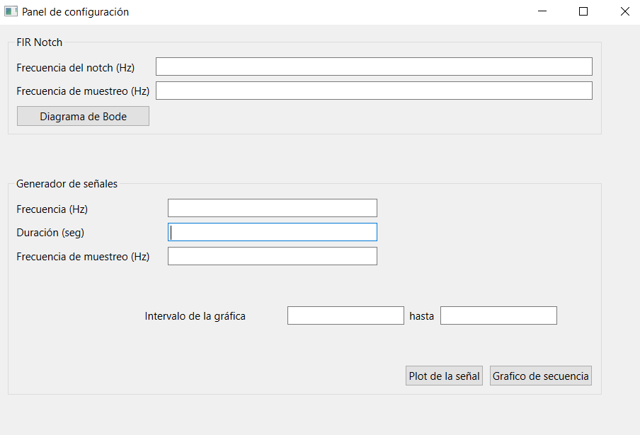

.. -*- coding: utf-8 -*-

.. _rcs_subversion:

Clase 16 - PIII 2022
====================
(Fecha: 17 de octubre)

Creación de GUI
===============

- QtDesigner para diseñar una interfaz con modalidad Drag and Drop.
- Creación de entorno virtual
- Instalación de bibliotecas
- Características de la biblioteca Qt
- Manejo de eventos
- Gráficos y reproducción

**Información**

- Ir a https://www.qt.io/download para descargar el QtCreator. No hace falta más que el QtCreator que tiene el QtDesigner que nos genera el .ui
- Ver aquí cómo se utiliza el .ui para generar la interfaz. https://www.pythonguis.com/tutorials/pyside-first-steps-qt-designer/

.. code-block:: bash 

	cd C:\Cosas\EntornosVirtuales
	mkdir PIII_con_GUI
	cd PIII_con_GUI

	virtualenv entorno_gui_piii
	.\entorno_gui_piii\Scripts\activate

	pip install numpy==1.19.5
	pip install shiboken6==6.0.0
	pip install PySide6==6.0.0 
	pip install matplotlib==3.3.4 
	pip install scipy==1.7.1
	pip install sounddevice==0.4.2

	python C:\Cosas\PIII\Codigos\GUI\ventana.py

Guía para creación de GUI
=========================

- Carpeta para contener el entorno virtual

.. code-block:: bash 

	cd C:\Cosas\EntornosVirtuales
	
- Creación y habilitación del entorno virtual

.. code-block:: bash 

	virtualenv entorno_gui_piii
	.\entorno_gui_piii\Scripts\activate

- Instalación de bibliotecas

.. code-block:: bash 

	pip install numpy==1.19.5
	pip install shiboken6==6.0.0
	pip install PySide6==6.0.0
	pip install matplotlib==3.3.4
	pip install scipy==1.7.1
	pip install sounddevice==0.4.2

- Creación de la interfaz gráfica con QtDesigner (que pertenece a QtCreator)
- New Project -- Application (Qt for Python) -- Window (UI FIle) -- Abrir el archivo .ui y diseñar

- Del proyecto creado con QtDesigner sólo utilizaremos el archivo .ui. Este archivo no es código Python sino que es un script XML el cual debe ser interpretado con la clase QUiLoader.

- Para ejecutar esta interfaz necesitamos un archivo Python como el que sigue:

.. code-block:: python 

	import os, sys

	from PySide6.QtCore import *
	from PySide6.QtWidgets import QWidget, QApplication, QGridLayout
	from PySide6.QtUiTools import QUiLoader

	import numpy as np

	from matplotlib import pyplot as plt
	plt.style.use( 'seaborn-darkgrid' )

	from scipy import signal
	import sounddevice as sd

	class Ventana( QWidget ) :

	    def __init__( self ) :
	        super( Ventana, self ).__init__()

	        loader = QUiLoader()
	        self.gui = loader.load( "panel.ui", None )  # panel.ui debe estar en la misma carpeta

	        # Define un layout en Ventana y coloca allí la interfaz creada con QtDesigner
	        grid = QGridLayout()
	        grid.setContentsMargins( 0, 0, 0, 0 )
	        grid.addWidget( self.gui )
	        self.setLayout( grid )

	        self.setWindowTitle( 'Panel de configuración' )

	        # Conexiones realizadas para capturar los eventos de la interfaz
	        QObject.connect( self.gui.pbSierraPlay, SIGNAL( "pressed()" ), self.slot_sierraPlay )
	        QObject.connect( self.gui.pbSierraPlot, SIGNAL( "pressed()" ), self.slot_sierraPlot )
	        QObject.connect( self.gui.pbCuadradaPlay, SIGNAL( "pressed()" ), self.slot_cuadradaPlay )
	        QObject.connect( self.gui.pbCuadradaPlot, SIGNAL( "pressed()" ), self.slot_cuadradaPlot )
	        QObject.connect( self.gui.pbCerrar, SIGNAL( "pressed()" ), self.slot_cerrarAplicacion )

	    def slot_cerrarAplicacion( self ) :
	        print( 'App cerrada' )
	        self.close()        

	    def slot_sierraPlay( self ) :
	        sample_rate = 44100
	        duracion = 1
	        n = np.linspace( 0, duracion, sample_rate * duracion )
	        plt.xlim( [ 0, 0.005 ] )

	        frecuencia = int( self.gui.leSierra.text() )
	        triangle = signal.sawtooth( 2 * np.pi * frecuencia * n, 0.5)      
	        sd.play( triangle, sample_rate )

	    def slot_sierraPlot( self ) :
	        sample_rate = 44100
	        duracion = 1
	        n = np.linspace( 0, duracion, sample_rate * duracion )
	        plt.xlim( [ 0, 0.005 ] )
	        frecuencia = int( self.gui.leSierra.text() )        
	        triangle = signal.sawtooth( 2 * np.pi * frecuencia * n, 0.5)
	        plt.plot( n, triangle )  
	        plt.show()

	    def slot_cuadradaPlay( self ) :
	        print( 'slot_cuadradaPlay' )

	    def slot_cuadradaPlot( self ) :
	        print( 'slot_cuadradaPlot' )        

	    def keyPressEvent( self, e ) :

	        if e.key() == Qt.Key_Escape :
	            self.close()

	# Función main que se ejecuta al iniciar la aplicación
	if __name__ == '__main__':

	    # Este objeto representa a la aplicación
	    app = QApplication( sys.argv )

	    os.chdir( os.path.dirname( os.path.abspath( __file__ ) ) )

	    # Creamos y visualizamos la Ventana que contiene la interfaz creada en QtDesigner
	    ventana = Ventana()
	    ventana.show()

	    sys.exit( app.exec_() )

- El código anterior lo almacenamos en un archivo ventana.py y debe estar en la misma carpeta que el archivo panel.ui que es la interfaz creada con QtDesigner. 
- No es necesario que estos archivos se encuentren en la carpeta donde fue creado el entorno virtual (y es recomendable que no estén allí).
- Para ejecutar la aplicación hacemos:

.. code-block:: bash 

	python C:\Cosas\PIII\Codigos\GUI\ventana.py

Entregable 13
=============

- Diseñar la interfaz anterior y ejecutar la aplicación.
- Agrupar las distintas funciones que se vienen usando y almacenarlas a todas en un único archivo .py
- En el siguiente `link el registro de los entregables <https://docs.google.com/spreadsheets/d/1VoiVIgvt3YoovQd4rFNI_tZY8dY8n2t-qkV3o7WgaOY/edit?usp=sharing>`_ 

