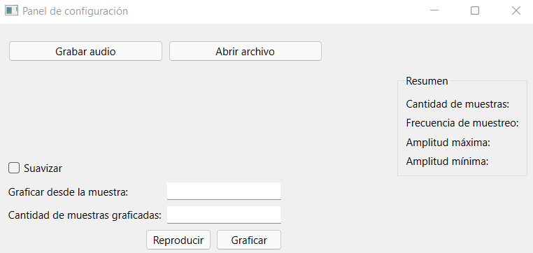

.. -*- coding: utf-8 -*-

.. _rcs_subversion:

Clase 17 - PIII 2022
====================
(Fecha: 21 de octubre)

Ejemplo para grabar y repoducir
===============================

ventana.py
----------

.. code-block:: python

	import os, sys

	from PySide6.QtCore import *
	from PySide6.QtWidgets import QWidget, QApplication, QGridLayout
	from PySide6.QtUiTools import QUiLoader

	import numpy as np

	from matplotlib import pyplot as plt
	plt.style.use( 'seaborn-darkgrid' )

	from scipy import signal
	import sounddevice as sd

	class Ventana( QWidget ) :
	    
	    def __init__( self ) :
	        super( Ventana, self ).__init__()

	        loader = QUiLoader()
	        self.gui = loader.load( "panel_clase19.ui", None )  # panel.ui debe estar en la misma carpeta

	        # Define un layout en Ventana y coloca allí la interfaz creada con QtDesigner
	        grid = QGridLayout()
	        grid.setContentsMargins( 0, 0, 0, 0 )
	        grid.addWidget( self.gui )
	        self.setLayout( grid )
	 
	        self.setWindowTitle( 'Panel de configuración' )

	        self.grabacion = 0

	        QObject.connect( self.gui.pbReproducir, SIGNAL( "pressed()" ), self.slot_reproducir )
	        QObject.connect( self.gui.pbGrabar, SIGNAL( "pressed()" ), self.slot_grabarAudio )

	    def slot_reproducir( self ) :
	        
	        frecuencia_muestreo = 44100
	        sd.play( self.grabacion, frecuencia_muestreo )

	        print( len( self.grabacion ) )
	        

	    def slot_grabarAudio( self ) :
	  
	        duracion = 3
	        frecuencia_muestreo = 44100
	          
	        self.grabacion = sd.rec( int( duracion * frecuencia_muestreo ), 
	        						 samplerate = frecuencia_muestreo, 
	        						 channels = 1, 
	        						 blocking = True ) 

	        print( type( self.grabacion ) )
	        print( self.grabacion, self.grabacion.shape )

	    def keyPressEvent( self, e ) :

	        if e.key() == Qt.Key_Escape :
	            self.close()

	# Función main que se ejecuta al iniciar la aplicación
	if __name__ == '__main__':

	    # Este objeto representa a la aplicación
	    app = QApplication( sys.argv )

	    os.chdir( os.path.dirname( os.path.abspath( __file__ ) ) )

	    # Creamos y visualizamos el objeto Ventana que contiene la interfaz creada en QtDesigner
	    ventana = Ventana()
	    ventana.show()

	    sys.exit( app.exec_() )

panel_clase19.ui
----------------

.. code-block:: python

	<?xml version="1.0" encoding="UTF-8"?>
	<ui version="4.0">
	 <class>Widget</class>
	 <widget class="QWidget" name="Widget">
	  <property name="geometry">
	   <rect>
	    <x>0</x>
	    <y>0</y>
	    <width>626</width>
	    <height>281</height>
	   </rect>
	  </property>
	  <property name="windowTitle">
	   <string>Widget</string>
	  </property>
	  <layout class="QGridLayout" name="gridLayout_2">
	   <item row="4" column="6">
	    <spacer name="horizontalSpacer">
	     <property name="orientation">
	      <enum>Qt::Horizontal</enum>
	     </property>
	     <property name="sizeHint" stdset="0">
	      <size>
	       <width>40</width>
	       <height>20</height>
	      </size>
	     </property>
	    </spacer>
	   </item>
	   <item row="4" column="3">
	    <spacer name="horizontalSpacer_4">
	     <property name="orientation">
	      <enum>Qt::Horizontal</enum>
	     </property>
	     <property name="sizeHint" stdset="0">
	      <size>
	       <width>40</width>
	       <height>20</height>
	      </size>
	     </property>
	    </spacer>
	   </item>
	   <item row="1" column="6" rowspan="3">
	    <widget class="QGroupBox" name="gbResumen">
	     <property name="title">
	      <string>Resumen</string>
	     </property>
	     <layout class="QGridLayout" name="gridLayout">
	      <item row="2" column="0">
	       <widget class="QLabel" name="lAmplMaxima">
	        <property name="text">
	         <string>Amplitud máxima:</string>
	        </property>
	       </widget>
	      </item>
	      <item row="0" column="0">
	       <widget class="QLabel" name="lCantMuestras">
	        <property name="text">
	         <string>Cantidad de muestras:</string>
	        </property>
	       </widget>
	      </item>
	      <item row="1" column="0">
	       <widget class="QLabel" name="lFrecMuestreo">
	        <property name="text">
	         <string>Frecuencia de muestreo:</string>
	        </property>
	       </widget>
	      </item>
	      <item row="3" column="0">
	       <widget class="QLabel" name="lAmplMinima">
	        <property name="text">
	         <string>Amplitud mínima:</string>
	        </property>
	       </widget>
	      </item>
	     </layout>
	    </widget>
	   </item>
	   <item row="0" column="6">
	    <spacer name="verticalSpacer_2">
	     <property name="orientation">
	      <enum>Qt::Vertical</enum>
	     </property>
	     <property name="sizeHint" stdset="0">
	      <size>
	       <width>20</width>
	       <height>40</height>
	      </size>
	     </property>
	    </spacer>
	   </item>
	   <item row="4" column="0" colspan="3">
	    <layout class="QHBoxLayout" name="horizontalLayout_2">
	     <item>
	      <layout class="QVBoxLayout" name="verticalLayout_2">
	       <item>
	        <widget class="QLabel" name="lDesdeLaMuestra">
	         <property name="text">
	          <string>Graficar desde la muestra:</string>
	         </property>
	        </widget>
	       </item>
	       <item>
	        <widget class="QLabel" name="lCantMuestrasGraficadas">
	         <property name="text">
	          <string>Cantidad de muestras graficadas:</string>
	         </property>
	        </widget>
	       </item>
	      </layout>
	     </item>
	     <item>
	      <layout class="QVBoxLayout" name="verticalLayout">
	       <item>
	        <widget class="QLineEdit" name="leDesdeLaMuestra"/>
	       </item>
	       <item>
	        <widget class="QLineEdit" name="leCantMuestrasGraficadas"/>
	       </item>
	      </layout>
	     </item>
	    </layout>
	   </item>
	   <item row="5" column="2">
	    <widget class="QPushButton" name="pbGraficar">
	     <property name="text">
	      <string>Graficar</string>
	     </property>
	    </widget>
	   </item>
	   <item row="3" column="0">
	    <widget class="QCheckBox" name="checkSuavizar">
	     <property name="text">
	      <string>Suavizar</string>
	     </property>
	    </widget>
	   </item>
	   <item row="2" column="2">
	    <spacer name="verticalSpacer">
	     <property name="orientation">
	      <enum>Qt::Vertical</enum>
	     </property>
	     <property name="sizeHint" stdset="0">
	      <size>
	       <width>20</width>
	       <height>40</height>
	      </size>
	     </property>
	    </spacer>
	   </item>
	   <item row="4" column="5">
	    <spacer name="horizontalSpacer_2">
	     <property name="orientation">
	      <enum>Qt::Horizontal</enum>
	     </property>
	     <property name="sizeHint" stdset="0">
	      <size>
	       <width>40</width>
	       <height>20</height>
	      </size>
	     </property>
	    </spacer>
	   </item>
	   <item row="5" column="0">
	    <spacer name="horizontalSpacer_5">
	     <property name="orientation">
	      <enum>Qt::Horizontal</enum>
	     </property>
	     <property name="sizeHint" stdset="0">
	      <size>
	       <width>40</width>
	       <height>20</height>
	      </size>
	     </property>
	    </spacer>
	   </item>
	   <item row="4" column="4">
	    <spacer name="horizontalSpacer_3">
	     <property name="orientation">
	      <enum>Qt::Horizontal</enum>
	     </property>
	     <property name="sizeHint" stdset="0">
	      <size>
	       <width>40</width>
	       <height>20</height>
	      </size>
	     </property>
	    </spacer>
	   </item>
	   <item row="0" column="0" colspan="4">
	    <layout class="QHBoxLayout" name="horizontalLayout">
	     <item>
	      <widget class="QPushButton" name="pbGrabar">
	       <property name="text">
	        <string>Grabar audio</string>
	       </property>
	      </widget>
	     </item>
	     <item>
	      <widget class="QPushButton" name="pbAbrir">
	       <property name="text">
	        <string>Abrir archivo</string>
	       </property>
	      </widget>
	     </item>
	    </layout>
	   </item>
	   <item row="5" column="1">
	    <widget class="QPushButton" name="pbReproducir">
	     <property name="text">
	      <string>Reproducir</string>
	     </property>
	    </widget>
	   </item>
	  </layout>
	 </widget>
	 <resources/>
	 <connections/>
	</ui>

Preparando el proyecto final
----------------------------

- Creación de GUI.
- Creación de ejecutable con `cx_Freeze <https://cx-freeze.readthedocs.io/en/latest/>`_ 
- Interfaz intuitiva y con prevención de errores humanos.
- Botones y campos de texto que se habiliten/deshabiliten oportunamente.

Entregable 14
=============

- Preparar una GUI que deshabilite y habilite botones y/o campos de texto oportunamente.
- Colocar los nombres de variables adecuados a los objetos de la GUI.
- Grabar un audio con el micrófono y luego tener la opción de reproducirlo o graficarlo. 
- Proponer mejoras en el código.
- En el siguiente `link el registro de los entregables <https://docs.google.com/spreadsheets/d/1VoiVIgvt3YoovQd4rFNI_tZY8dY8n2t-qkV3o7WgaOY/edit?usp=sharing>`_ 

