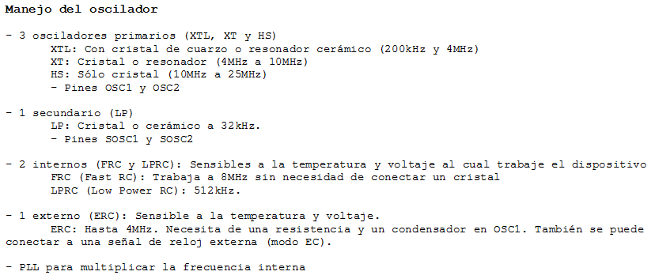
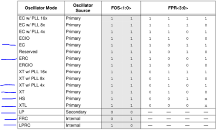
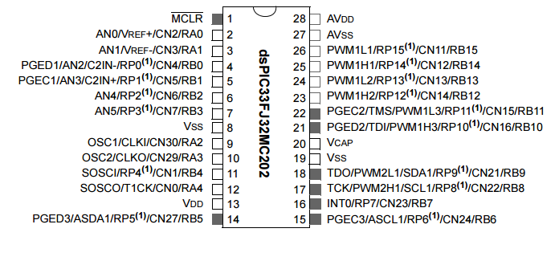
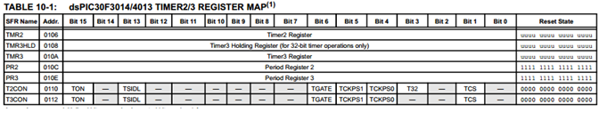

.. -*- coding: utf-8 -*-

.. _rcs_subversion:

Clase 19 - PIII 2022
====================
(Fecha: 31 de octubre)

.. figure:: images/calculo_fcy.png

Pinout de algunos dsPIC
-----------------------

.. figure:: images/dspic30f4013.png
   :target: http://ww1.microchip.com/downloads/en/devicedoc/70138c.pdf

.. figure:: images/manejo_timers.png

.. figure:: images/ejemplo_conexion_micro.png

.. code-block::

	void detectarIntT1() org 0x001a  {
	    LATBbits.LATB0 = !LATBbits.LATB0;
	    IFS0bits.T1IF = 0;  // Borramos la bandera de interrupción T1
	}

	void main()  {
	    TRISBbits.TRISB0 = 0;
	    LATBbits.LATB0 = 0;

	    // Modo de operación Timer1
	    T1CON = 0x0000;

	    // Modo operación Timer1: reloj interno, escala 1:1, empieza cuenta en 0
	    TMR1 = 0;

	    // Cuenta 500 ciclos
	    PR1 = 500;

	    // Interrupciones Timer1, borra Bandera de interrupción
	    IFS0bits.T1IF = 0;

	    // Habilita interrupción
	    IEC0bits.T1IE = 1;

	    // Arranca Timer1
	    T1CONbits.TON = 1;

	    while( 1 )
	       asm nop;
	}

Entregable 15
=============

- Preparar para el lunes 7 de noviembre la propuesta para el final.
- Leer la clase 2 de PIII en GitHub y definir la modalidad para el examen final.
- Escribir un documento con algunas de estas definiciones y enviarlas por mail.
- En el siguiente `link el registro de los entregables <https://docs.google.com/spreadsheets/d/1VoiVIgvt3YoovQd4rFNI_tZY8dY8n2t-qkV3o7WgaOY/edit?usp=sharing>`_ 

