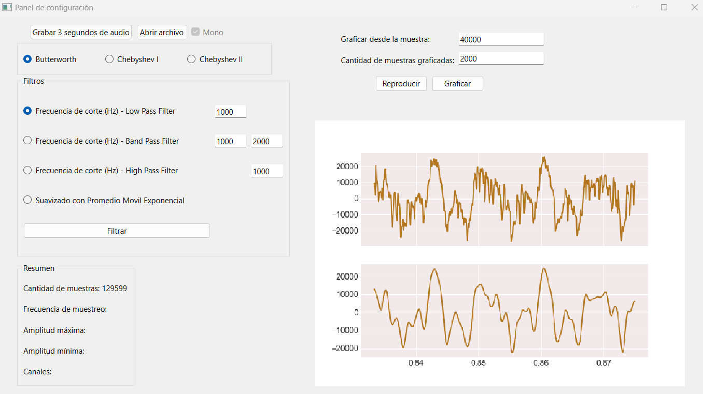

.. -*- coding: utf-8 -*-

.. _rcs_subversion:

Clase 22 - PIII 2022
====================
(Fecha: 14 de noviembre)

Para el Examen final 
--------------------

- Se puede presentar un proyecto integrador individual con Simulink y/o Python.
- También se puede rendir mediante la resolución de un ejercicio con Python para resolver en 1 hora y una parte teórica para responder oralmente.
- `Rúbrica para proyecto <https://docs.google.com/spreadsheets/d/18-XsvzJjZnIyQqK9O1-GQci-dNzbXkrgUY8ffqbhvIo/edit?usp=sharing>`_ 

**Consideraciones**

- Es necesario previamente comunicar al docente el contenido que se quiere desarrollar para el final.
- 3 días antes de la fecha del examen se debe presentar el trabajo con la mayoría de las funcionalidades.
- En caso de faltar bastante, ahí se decidirá si está apto para presentar en esa fecha o pasa para la siguiente.

Ejemplo para graficar sobre GUI
===============================

- `Aquí un ejemplo graficando sobre un gui <https://github.com/cosimani/Curso-PIII-2022/blob/main/images/ejemplo_graficar_en_gui.rar?raw=true>`_  
